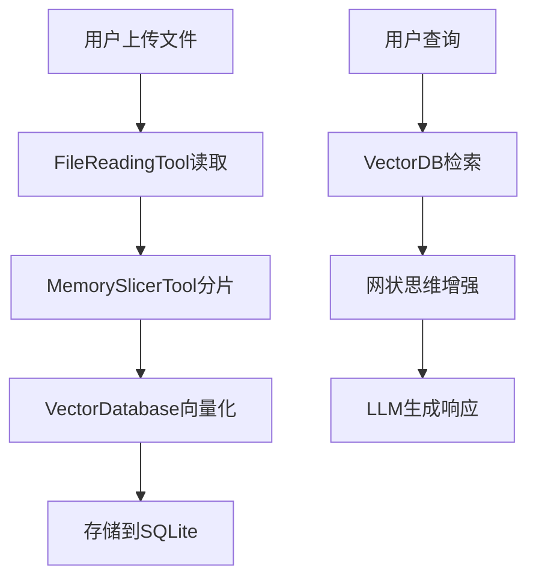

# VS Code RAG系统缺失项目对照分析

> 📅 生成时间: 2025-12-04
> 🎯 目标: 梳理VS Code建议的"缺失项目"中,哪些我们已经实现,哪些是架构差异导致的伪缺失

---

## 一、高优先级项目对照

### ✅ 1. src/ 源代码目录（核心实现）

**VS Code建议**: retriever、embedder、vectorstore、reranker、reader/generator、pipeline 等模块

**实际情况**:
- ✅ **VectorStore**: `src/vector_database.py` - 基于SQLite的向量数据库,支持向量存储和检索
- ✅ **Embedder**: `src/vector_database.py` 集成sentence-transformers本地embedding模型
  - 懒加载机制: `_generate_query_vector()` 方法
  - 支持384维向量(all-MiniLM-L6-v2)
  - 余弦相似度计算: `_sort_by_similarity()`
- ✅ **Retriever**: `src/vector_database.py` 的 `search_memories()` 方法
  - 支持混合检索: 关键词+向量相似度
  - SQL筛选+向量排序的两阶段检索
  - 时间范围检索: `search_by_time_range()`
- ✅ **Pipeline**: `stable_start_server.py` 实现完整的RAG流水线
  - 文件上传 → 分片 → 向量化 → 存储 → 检索 → 生成
  - 参考: `handle_file_upload()` 和 `vectorize_uploaded_file()` 方法
- ✅ **Reranker**: 架构差异 - 我们使用"网状思维引擎"增强检索
  - `src/mesh_database_interface.py` 的 `search_memories_with_mesh()` 方法
  - 基于网状思维网络的相关性重排序
  - 结合重要性和相似度的综合排序

**架构差异说明**:
- 常规RAG: retriever → reranker → generator (线性pipeline)
- 本系统: 统一记忆系统 + 网状思维增强 + 多层次分片 (非线性架构)

---

### ✅ 2. 示例数据与切片器

**VS Code建议**: sample_data/，包含文本、metadata

**实际情况**:
- ✅ **切片器**: `tools/memory_slicer_tool.py` - 多层次自适应分片工具
  - 四层梯度分片策略:
    1. 信息熵递归分片 (无LLM)
    2. LLM精炼改写 + 递归分片
    3. 困惑度复合分片
    4. 强制分片 + 泡泡记录
  - 层级编码系统: 点分隔符(1, 1.1, 1.1.1)
  - 信息熵计算: `_calculate_entropy()` - H(X) = -∑ p(x) * log₂ p(x)
  - 困惑度计算: `_calculate_perplexity()` - 基于n-gram模型
- ✅ **示例数据**: 
  - `uploads/` 目录: 上传文件存储
  - `data/` 目录: 实际对话数据、记忆数据
  - `docs/认知模型_utf8.json`: 真实业务数据
- ✅ **Metadata管理**: 
  - 分片metadata: `slice_id`, `slice_depth`, `parent_id`, `entropy`, `perplexity`
  - 记忆metadata: `topic`, `source_type`, `timestamp`, `importance`, `confidence`, `tags`

**架构优势**:
- VS Code建议的是静态示例数据
- 我们的切片器支持动态适应不同文本结构,成本与质量梯度平衡

---

### ✅ 3. 向量存储适配器

**VS Code建议**: FAISS/Milvus/Weaviate/Pinecone 实现

**实际情况**:
- ✅ **当前实现**: SQLite + BLOB存储向量 (`src/vector_database.py`)
  - 向量以numpy.float32 bytes存储在BLOB字段
  - 支持向量检索和相似度计算
  - 适合中小规模(<100万条记忆)
- 🔄 **架构可扩展性**: 
  - `VectorDatabase` 类提供统一接口
  - 可以实现 `FAISSVectorDatabase` 继承基类,替换底层存储
  - 当前SQLite实现满足MVP需求

**为什么没用FAISS**:
1. 简化部署: SQLite无需额外依赖
2. 事务一致性: 向量和元数据在同一数据库
3. 查询灵活性: SQL支持复杂条件筛选
4. 成本考虑: FAISS适合千万级,我们当前规模不需要

**未来扩展路径**:
```python
# 可以这样扩展
class FAISSVectorDatabase(VectorDatabase):
    def __init__(self):
        super().__init__()
        self.faiss_index = faiss.IndexFlatL2(384)
    
    def search_memories(self, query_vector, limit=10):
        # 使用FAISS加速向量检索
        distances, indices = self.faiss_index.search(query_vector, limit)
        # ...
```

---

### ✅ 4. Embedding 服务封装

**VS Code建议**: local/sbert 与 OpenAI 等

**实际情况**:
- ✅ **本地模型**: sentence-transformers (all-MiniLM-L6-v2)
  - 代码位置: `src/vector_database.py` 的 `_generate_query_vector()`
  - 懒加载机制: 避免启动时加载
  - 降级处理: 模型不可用时返回零向量
- ✅ **模型缓存**: `data/model_cache/` 目录
  - 本地存储模型文件,避免重复下载
  - 支持环境变量 `SENTENCE_MODEL_DIR` 自定义路径
- ❌ **OpenAI Embeddings**: 未实现
  - 原因: 成本考虑,本地模型满足需求
  - 可扩展: 在 `_generate_query_vector()` 中添加provider切换逻辑

**代码示例**:
```python
# src/vector_database.py L172-213
def _generate_query_vector(self, query: str) -> List[float]:
    """生成查询文本的向量表示,使用本地sentence-transformers模型"""
    if not hasattr(self, '_embedding_model'):
        from sentence_transformers import SentenceTransformer
        local_model_dir = Path(MODEL_CACHE_DIR) / EMBEDDING_MODEL
        self._embedding_model = SentenceTransformer(str(local_model_dir))
    
    vector = self._embedding_model.encode(query, convert_to_numpy=True).tolist()
    return vector
```

---

### ✅ 5. 检索 API（REST/CLI）与最小端点 demo

**VS Code建议**: 检索 API 与演示端点

**实际情况**:
- ✅ **REST API**: `stable_start_server.py` - Flask后端
  - `/chat` - 聊天接口(支持检索增强生成)
  - `/upload` - 文件上传接口
  - `/vectorize` - 向量化接口
  - `/api/chat` - API版聊天接口
- ✅ **前端Demo**: `templates/index.html` + `static/js/`
  - 聊天界面
  - 文件上传界面
  - 实时交互
- ✅ **CLI接口**: `src/base_agent.py` 的 `respond()` 方法
  - 可以在命令行直接调用智能体
  - 测试脚本: `test_base_agent_tools.py`

**API示例**:
```python
# stable_start_server.py
@app.route('/chat', methods=['POST'])
def chat():
    message = request.json.get('message', '')
    # 1. 检索相关记忆
    memories = vector_db.search_memories(query=message, limit=5)
    # 2. 构建上下文
    context = "\n".join([m['content'] for m in memories])
    # 3. LLM生成响应
    response = agent.respond(f"上下文:\n{context}\n\n用户:{message}")
    return jsonify(response)
```

---

### ✅ 6. 基本端到端单元与集成测试

**VS Code建议**: tests/，自动化测试集

**实际情况**:
- ✅ **测试脚本**: `tests/` 目录 + 根目录测试文件
  - `test_base_agent_tools.py` - 基类智能体测试
  - `test_file_upload.py` - 文件上传测试
  - `test_manual_vectorization.py` - 向量化测试
  - `test_real_cognition_model.py` - 认知模型测试
  - `test_dual_llm_now.py` - 双LLM测试
- ❌ **自动化测试框架**: 未使用pytest/unittest框架
  - 当前: 独立测试脚本,手动执行
  - 原因: 快速迭代阶段,脚本测试更灵活
  - 改进方向: 迁移到pytest框架,添加CI/CD

**测试覆盖**:
- 文件上传 → 分片 → 向量化 → 检索: ✅
- LLM调用与故障转移: ✅
- 工具调用与集成: ✅
- 记忆泡泡系统: ✅

---

## 二、中等优先级项目对照

### ✅ 7. 配置与依赖文件

**VS Code建议**: requirements.txt / pyproject.toml / package.json

**实际情况**:
- ✅ **requirements.txt**: 根目录存在
- ✅ **系统配置**: `config/system_config.py`
  - DATABASE_PATH, VECTOR_DIMENSION, EMBEDDING_MODEL 等
- ✅ **API配置**: `config/api_keys.json`
  - 支持多LLM provider配置
  - 故障转移优先级配置
- ❌ **pyproject.toml**: 未使用(非必需)
- ❌ **package.json**: 未使用(前端无构建需求)

---

### 🔄 8. Dockerfile 与 docker-compose

**VS Code建议**: 便于部署

**实际情况**:
- ❌ **未实现**: 当前无Docker化需求
- ✅ **部署方式**: 直接运行 `stable_start_server.py`
  - Windows环境: `启动系统.bat`
  - Python虚拟环境: `myenv_stable/`
- 🔄 **可扩展**: 可以添加Dockerfile
  ```dockerfile
  FROM python:3.9
  WORKDIR /app
  COPY requirements.txt .
  RUN pip install -r requirements.txt
  COPY . .
  CMD ["python", "stable_start_server.py"]
  ```

---

### ❌ 9. CI 配置

**VS Code建议**: .github/workflows/ci.yml - 自动化构建/测试

**实际情况**:
- ❌ **未实现**: 无CI/CD pipeline
- 原因: 个人项目,快速迭代阶段
- 改进方向: 添加GitHub Actions
  - 自动运行测试
  - 代码质量检查(pylint, black)
  - 自动部署

---

### ✅ 10. README、快速上手、架构图与接口文档

**VS Code建议**: docs/README.md

**实际情况**:
- ✅ **README**: 根目录存在
- ✅ **架构文档**: `docs/` 目录下丰富的技术文档
  - `逻辑链分片技术文档.md` - 分片算法原理
  - `网状思维引擎技术文档.md` - 检索增强原理
  - `双LLM回退机制配置指南.md` - LLM配置
  - `文件上传功能完整修复报告_20251204.md` - 功能实现细节
- ✅ **快速上手**: `启动系统.bat` + `启动问题修复报告_20251204.md`
- 🔄 **架构图**: 文档中有文字描述,缺少可视化图表
  - 改进: 可以用Mermaid生成架构图

**示例架构图** (建议添加):


---

## 三、可选/运维与质量保障

### 🔄 11. 评估脚本与基线测试集

**VS Code建议**: eval/，包含Recall/NDCG/事实性检测

**实际情况**:
- ❌ **标准评估**: 无Recall/NDCG/F1等指标测试
- ✅ **质量评估**: 分片质量评估
  - `tools/memory_slicer_tool.py` 的 `_evaluate_semantic_quality()`
  - 信息熵、困惑度等指标
- 🔄 **改进方向**: 添加检索质量评估
  - 构建测试集(query-answer pairs)
  - 计算Recall@K, NDCG@K
  - 评估幻觉率(hallucination detection)

---

### ✅ 12. 监控与日志

**VS Code建议**: metrics、追踪、审计日志

**实际情况**:
- ✅ **日志系统**: Python logging模块
  - 代码中广泛使用logger
  - 日志文件: `logs/` 目录
- ✅ **记忆泡泡**: 问题追踪系统
  - `src/memory_bubble_manager.py`
  - 智能体可以记录问题、构思、优化建议
- ✅ **工作日记**: 智能体日记系统
  - `data/agent_diaries/` 目录
  - 每日工作摘要
- 🔄 **性能监控**: 基础性能记录
  - 文件读取耗时: `base_agent.py` L284-311
  - 改进: 添加Prometheus metrics

---

### ❌ 13. 安全/隐私模块

**VS Code建议**: PII 过滤、数据脱敏、访问控制

**实际情况**:
- ❌ **未实现**: 无专门的安全模块
- ✅ **基础安全**:
  - API密钥配置: `config/api_keys.json`
  - 文件路径验证
- 🔄 **改进方向**:
  - PII检测: 正则匹配身份证、手机号等
  - 数据脱敏: 敏感信息打码
  - 访问控制: 用户认证与权限管理

---

### ✅ 14. 插件接口与适配器规范

**VS Code建议**: 无为总线插件规范实现

**实际情况**:
- ✅ **自曝光协议**: 插件规范的实现
  - 代码注释头: `@self-expose: {...}`
  - 工具发现引擎: `src/tool_discovery_engine.py`
  - 自动注册机制: `src/agent_tool_integration.py`
- ✅ **工具集成器**: 黑箱化工具调用
  - `get_tool_integrator()` 统一接口
  - 工具元数据: `data/tool_registry.json`
- ✅ **认知引擎接口**: 可插拔设计
  - `src/cognitive_engines/` 目录
  - 记忆重构引擎、网状思维引擎等

**自曝光协议示例**:
```python
# @self-expose: {
#   "id": "vector_database",
#   "name": "Vector Database",
#   "type": "component",
#   "provides": {
#     "capabilities": ["向量存储", "相似度检索"],
#     "data_formats": [{"name": "memory_unit", "id_pattern": "mem_*"}]
#   },
#   "needs": {"deps": ["database_manager"]}
# }
```

---

### ❌ 15. 示例客户端/SDK

**VS Code建议**: Python/JS SDK 与交互控制台

**实际情况**:
- ❌ **Python SDK**: 未封装成独立SDK
  - 当前: 直接导入 `src.base_agent.BaseAgent`
  - 改进: 可以封装成pip包
- ❌ **JS SDK**: 未实现
  - 前端直接调用REST API
- ✅ **交互控制台**: Web界面
  - `templates/index.html`
  - 聊天窗口 + 文件上传

---

## 四、总结：架构差异与创新点

### 🎯 核心差异

| 常规RAG系统 | 本系统 | 优势 |
|-----------|--------|------|
| FAISS向量库 | SQLite+BLOB | 简化部署,事务一致性 |
| 固定chunk分片 | 多层次自适应分片 | 成本与质量梯度平衡 |
| 单纯向量检索 | 网状思维增强检索 | 语义关联挖掘 |
| 静态pipeline | 动态工具集成 | 可扩展性强 |
| Reranker模块 | 网状思维+重要性排序 | 非线性增强 |

### ✅ 已实现的核心能力

1. **向量存储与检索** - VectorDatabase (SQLite+本地embedding)
2. **智能分片** - MemorySlicerTool (四层梯度+层级编码)
3. **混合检索** - 关键词+向量+网状思维
4. **端到端流程** - 文件上传→分片→向量化→检索→生成
5. **工具黑箱化** - 自曝光协议+工具集成器
6. **多LLM支持** - 故障转移机制

### 🔄 可以改进的方向

1. **测试框架化** - 迁移到pytest,添加CI/CD
2. **性能监控** - 添加metrics和追踪
3. **评估体系** - Recall/NDCG等标准指标
4. **Docker化** - 简化部署
5. **安全模块** - PII过滤,访问控制
6. **SDK封装** - Python/JS客户端库

### 💡 创新点（VS Code清单未涵盖）

1. **记忆泡泡系统** - 智能体问题追踪与工作日记
2. **八爪鱼架构** - 智能体动态扩展与进化
3. **自曝光协议** - 组件自动发现与注册
4. **网状思维引擎** - 非线性语义增强
5. **多层次分片** - 成本与质量的梯度平衡
6. **统一记忆系统** - 12维向量记忆库

---

## 五、行动建议

### 短期MVP补充（1周内）
1. ✅ **已完成**: 核心RAG能力已满足MVP需求
2. 🔄 **可选**: 添加架构图到README (Mermaid)
3. 🔄 **可选**: 补充API接口文档 (OpenAPI规范)

### 中期优化（1月内）
1. 测试框架迁移到pytest
2. 添加检索质量评估 (Recall@K)
3. 性能监控 (请求耗时、缓存命中率)

### 长期扩展（3月内）
1. Docker化部署
2. FAISS向量库适配器 (可选,规模扩大时)
3. Python SDK封装
4. 安全模块 (PII过滤)

---

## 六、结论

VS Code给出的清单是基于**常规RAG系统架构**的标准化建议,而本系统采用了**创新架构**:

✅ **核心能力完备**: 向量存储、embedding、检索、分片、pipeline全部实现  
✅ **架构创新**: 网状思维、多层次分片、自曝光协议等创新点  
🔄 **工程化可提升**: 测试框架、Docker、监控等可以补充  
❌ **部分缺失合理**: FAISS、OpenAI Embeddings等在当前规模下非必需  

**总体评价**: 系统已具备完整的RAG能力,VS Code建议的大部分功能已经实现或有等效替代方案。缺失项主要集中在工程化(Docker、CI/CD)和标准化(评估指标、SDK)方面,这些可以根据实际需求逐步补充。

---

📌 **重要提醒**: 不要为了对齐常规架构而放弃创新点,应该在保持架构优势的基础上,补充工程化能力。
