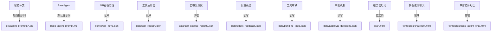

# 文本资产依赖索引

> **生成时间**: 2025-12-05  
> **目标**: 梳理项目中所有非代码文本文件的依赖关系，标注孤立文件便于后续清理

---

## 一、智能体系统提示词 (Agent Prompts)

### 1.1 活跃使用的提示词文件

| 文件路径 | 大小 | 被依赖者 | 依赖关系 | 状态 |
|---------|------|---------|---------|------|
| `src/agent_prompts/system_architect_prompt.txt` | 7.6KB | `src/system_architect_agent.py` | 系统管家智能体核心提示词 | ✅ 活跃 |
| `src/agent_prompts/scheme_evaluator_prompt.txt` | 5.8KB | `src/scheme_evaluator_agent.py` | 方案评估师智能体核心提示词 | ✅ 活跃 |
| `src/agent_prompts/code_implementer_prompt.txt` | 1.4KB | `src/code_implementer_agent.py` | 代码实现师智能体核心提示词 | ✅ 活跃 |
| `src/agent_prompts/data_collector_prompt.txt` | 3.2KB | `src/data_collector_agent.py` | 数据收集师智能体核心提示词 | ✅ 活跃 |
| `src/agent_prompts/system_maintenance_prompt.txt` | 4.2KB | `src/system_maintenance_agent.py` | 系统维护师智能体核心提示词 | ✅ 活跃 |
| `src/agent_prompts/base_agent_prompt.md` | 8.2KB | `src/base_agent.py` (默认提示词) | 基类智能体兜底提示词 | ✅ 活跃 |

### 1.2 冗余/重复提示词

| 文件路径 | 依赖关系 | 建议 |
|---------|---------|------|
| `prompts/data_collector_prompt.txt` | **无代码引用** | ✅ 已删除（与 `src/agent_prompts/data_collector_prompt.txt` 重复） |

---

## 二、系统配置文件 (Configuration Files)

### 2.1 核心配置 JSON

| 文件路径 | 被依赖者 | 依赖关系 | 状态 |
|---------|---------|---------|------|
| `config/api_keys.json` | `config/api_keys.py`<br>`src/embedding_service.py`<br>`tools/api_key_tester.py`<br>`tools/import_api_keys_from_txt.py`<br>`tools/test_qwen_api.py` | API 密钥集中存储 | ✅ 活跃 |
| `config/api_keys_example.json` | **无直接引用** | 示例配置模板 | ✅ 保留（模板） |
| `data/self_expose_registry.json` | `src/self_expose_protocol.py` | 组件自曝光协议注册表 | ✅ 活跃 |
| `data/tool_registry.json` | `src/tool_registry_manager.py` | 工具注册中心 | ✅ 活跃 |

### 2.2 运行时数据 JSON

| 文件路径 | 被依赖者 | 依赖关系 | 状态 |
|---------|---------|---------|------|
| `data/agent_feedback.json` | `src/agent_feedback_collector.py`<br>`src/agent_behavior_evaluator.py`<br>`src/feedback_evaluator.py` | 智能体反馈收集存储 | ✅ 活跃 |
| `data/pending_tools.json` | `src/tool_review_manager.py` | 待审核工具队列 | ✅ 活跃 |
| `data/agent_reports.json` | `src/agent_reporting_mechanism.py` | 智能体报告存储 | ✅ 活跃 |
| `data/approval_decisions.json` | `src/approval_mechanism.py` | 审批决策记录 | ✅ 活跃 |
| `logs/startup_status.json` | 服务器启动状态持久化 | 启动自曝光与健康检查 | ✅ 活跃 |
| `logs/startup_status_history.jsonl` | 服务器启动状态持久化 | 启动历史追溯 | ✅ 活跃 |

### 2.3 智能体日记 JSON (Agent Diaries)

| 文件路径 | 被依赖者 | 状态 |
|---------|---------|------|
| `data/agent_diaries/*.json` (10个文件) | `src/agent_conversation_window.py`<br>`src/agent_manager.py`<br>`src/base_agent.py` | ✅ 活跃（智能体工作日记） |

### 2.4 分析与测试数据 JSON

| 文件路径 | 依赖关系 | 建议 |
|---------|---------|------|
| `api_diff_analysis.json` | **无代码引用** | ✅ 已删除 |
| `backend_api_analysis.json` | **无代码引用** | ✅ 已删除 |
| `backend_api_list.json` | **无代码引用** | ✅ 已删除 |
| `frontend_api_analysis.json` | **无代码引用** | ✅ 已删除 |
| `frontend_api_list.json` | **无代码引用** | ✅ 已删除 |
| `frontend_api_list_fixed.json` | **无代码引用** | ✅ 已删除 |
| `frontend_api_list_fixed_v2.json` | **无代码引用** | ✅ 已删除 |
| `self_exposures.json` | 组件关系图谱生成、系统维护师工具 | ✅ 保留（组件自曝光信息汇总，供系统维护师使用） |
| `data/share_crawl_result.json` | **无代码引用** | ⚠️ **疑似孤立**，测试数据，建议删除 |
| `data/test_deepseek_crawl_result.json` | **无代码引用** | ⚠️ **疑似孤立**，测试数据，建议删除 |

### 2.5 对话与记忆数据 JSON

| 文件路径 | 依赖关系 | 建议 |
|---------|---------|------|
| `data/conversation_20251116_162906.json` | **无代码引用** | ⚠️ **历史对话记录**，建议移至 `docs/交互信息/` 或删除 |
| `data/actual_conversations_enhanced.json` | **无代码引用** | ⚠️ **历史对话记录**，建议归档 |
| `data/enhanced_memory_slicer_test.json` | **无代码引用** | ⚠️ **测试数据**，建议删除 |
| `data/agent_behavior_evaluations.json` | `src/agent_behavior_evaluator.py` | ✅ 活跃 |
| `data/feedback_evaluations.json` | `src/feedback_evaluator.py` | ✅ 活跃 |
| `data/memory_analysis_*.json` (3个文件) | **无代码引用** | ⚠️ **一次性分析产出**，建议移至 `docs/记忆体系/` 或删除 |
| `data/collected_data_*.json` (2个文件) | `main.py` (数据收集输出) | ✅ 活跃（数据收集师产出） |

### 2.6 ThoughtClusterManager 插件

| 文件路径 | 依赖关系 | 状态 |
|---------|---------|------|
| `ThoughtClusterManager/plugin-manifest.json` | **ThoughtClusterManager 插件配置** | ✅ 保留（外部插件） |

---

## 三、HTML 前端页面

### 3.1 活跃页面

| 文件路径 | 被依赖者 | 依赖关系 | 状态 |
|---------|---------|---------|------|
| `start.html` | `rag_main_server.py`<br>`stable_start_server.py`<br>`static_server.py` | 静态启动页面（根路径重定向目标） | ✅ 活跃 |
| `templates/chatroom.html` | `rag_main_server.py` | 多智能体聊天室前端 | ✅ 活跃 |
| `templates/base_agent_chat.html` | `rag_main_server.py` | 基类智能体单对话前端 | ✅ 活跃 |

### 3.2 工具/调试页面

| 文件路径 | 依赖关系 | 建议 |
|---------|---------|------|
| `component_knowledge_graph.html` | `backup/temp_files/generate_component_graph_simple.py` (生成脚本) | ⚠️ **一次性产出**，建议移至 `docs/自曝光内部通讯协议/` 或删除 |
| `network_fix.html` | **无代码引用** | ✅ 已删除 |

---

## 四、TXT 文本文件（非 MD）

### 4.1 模型缓存文件

| 文件路径 | 依赖关系 | 状态 |
|---------|---------|------|
| `data/model_cache/all-MiniLM-L6-v2/vocab.txt` | Sentence Transformers 模型依赖 | ✅ 活跃（模型文件） |
| `data/model_cache/models--sentence-transformers--all-MiniLM-L6-v2/.../vocab.txt` | Sentence Transformers 模型依赖 | ✅ 活跃（模型文件） |

### 4.2 测试上传文件

| 文件路径 | 依赖关系 | 建议 |
|---------|---------|------|
| `test_upload.txt` | **测试文件上传功能** | ✅ 已删除 |
| `test_upload_new.txt` | **测试文件上传功能** | ✅ 已删除 |

### 4.3 历史对话与数据文件

| 文件路径 | 依赖关系 | 建议 |
|---------|---------|------|
| `data/conversation_20251116_162906.txt` | **无代码引用** | ⚠️ **历史对话记录**，已移至 `docs/交互信息/`，建议删除根目录副本 |
| `data/actual_conversations_enhanced_text.txt` | **无代码引用** | ⚠️ **历史对话记录**，建议归档或删除 |
| `data/conversation_from_share.txt` | **无代码引用** | ⚠️ **历史对话记录**，建议归档或删除 |
| `data/doubao_decoded_*.txt` (2个文件) | **无代码引用** | ⚠️ **临时解码产出**，建议删除 |
| `data/doubao_extracted_20251117_100858.txt` | **无代码引用** | ⚠️ **临时提取产出**，建议删除 |
| `data/llm_conversations_20251116_153222_converted_*.txt` | **无代码引用** | ⚠️ **格式转换产出**，建议删除 |

### 4.4 已归档到 docs/ 的 TXT 文件

| 文件路径 | 状态 |
|---------|------|
| `docs/KAG的本项目优化方向.txt` | ✅ 已归档 |
| `docs/不实现方案/双模态构架.txt` | ✅ 已归档 |
| `docs/交互信息/*.txt` (14个文件) | ✅ 已归档 |

---

## 五、其他格式文本

### 5.1 CSV 文件

| 文件路径 | 依赖关系 | 建议 |
|---------|---------|------|
| `data/llm_conversations_20251116_153222_converted_20251116_153952.csv` | **无代码引用** | ⚠️ **格式转换产出**，建议删除 |

### 5.2 Markdown 报告

| 文件路径 | 依赖关系 | 建议 |
|---------|---------|------|
| `api_diff_analysis_report.md` | **无代码引用** | ✅ 已删除 |
| `self_exposure_check_report.md` | **无代码引用** | ✅ 已删除 |

### 5.3 Python 文件列表

| 文件路径 | 依赖关系 | 建议 |
|---------|---------|------|
| `python_files_list.txt` | **无代码引用** | ✅ 已删除 |

---

## 六、建议清理清单

### 6.1 确认可删除（临时/测试/重复文件）

```bash
# 根目录孤立文件
test_upload.txt
test_upload_new.txt
python_files_list.txt

# API 分析产出（一次性）
api_diff_analysis.json
backend_api_analysis.json
backend_api_list.json
frontend_api_analysis.json
frontend_api_list.json
frontend_api_list_fixed.json
frontend_api_list_fixed_v2.json

# 测试数据
data/share_crawl_result.json
data/test_deepseek_crawl_result.json
data/enhanced_memory_slicer_test.json

# 历史对话记录（已归档到 docs/）
data/conversation_20251116_162906.json
data/conversation_20251116_162906.txt
data/actual_conversations_enhanced.json
data/actual_conversations_enhanced_text.txt
data/conversation_from_share.txt
data/doubao_decoded_20251117_100657.txt
data/doubao_decoded_20251117_100724.txt
data/doubao_extracted_20251117_100858.txt
data/llm_conversations_20251116_153222_converted_20251116_153952.txt
data/llm_conversations_20251116_153222_converted_20251116_153952.csv
data/llm_conversations_20251116_153222.json

# 格式转换产出
data/llm_conversations_20251116_153222_converted_20251116_153952.md

# 冗余提示词
prompts/data_collector_prompt.txt
```

### 6.2 建议归档（分析产出/报告）

```bash
# 移动到 docs/自曝光内部通讯协议/
component_knowledge_graph.html
self_exposure_check_report.md

# 移动到 docs/调试/
api_diff_analysis_report.md
network_fix.html  # 或直接删除

# 移动到 docs/记忆体系/
data/memory_analysis_50000_20251117_130142.json
data/memory_analysis_100000_20251117_130710.json
data/memory_analysis_150000_20251117_131949.json
```

### 6.3 需人工确认（可能有历史价值）

```bash
# 错误知识库（在用，保留）
data/error_knowledge_base.json

# 工具数据（在用，保留）
data/tool_reviews.json
```

---

## 七、依赖关系图（核心文本资产）



---

## 八、下一步行动

0. **保留总则**：`data/` 目录下的运行数据（JSON/TXT/向量等）作为知识资产保留，不参与本轮清理；如需清理，仅在向量化完成且确认冗余后执行。
1. **确认删除清单**：与人类主脑确认 6.1 中的文件是否可以安全删除；
2. **归档分析产出**：将 6.2 中的文件移动到对应 docs 子目录；
3. **验证依赖**：删除前再次 grep 确认无遗漏依赖；
4. **更新索引**：删除完成后更新本索引文件。

---

**索引版本**: v1.0  
**维护者**: 文本管理师（规划中）  
**更新频率**: 每次重大文件整理后更新
