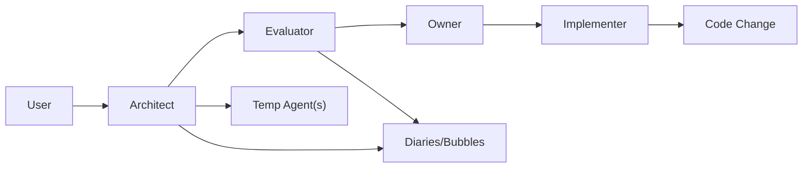

# 三层架构权限与临时智能体招募规范
<!-- @self-expose: {"id": "temp_agent_governance_doc", "name": "三层架构权限与临时智能体招募规范", "type": "doc", "version": "1.0.0", "needs": {"deps": [], "resources": []}, "provides": {"capabilities": ["治理规范", "临时智能体招募策略"]}} -->

### 背景与目标
- **目标**：将“主-功能-临时智能体”三层架构的责权边界与操作流程标准化，降低后续维护与协作的认知成本。
- **适用范围**：系统管家、方案评估师、文本实现师、数据收集师、系统维护师及所有临时智能体相关流程。

### 架构分层与职责
- **人类主脑（Owner）**：最终审批与方向把控。
- **系统管家（Architect / 主智能体）**：需求翻译、方案生成、智能体调度、临时智能体招募、写日记/泡泡/报告；不写代码。
- **方案评估师（Evaluator / 功能智能体）**：评估“被需要 + 不冗余”，给出改进建议与是否通过；不写代码。
- **文本实现师（Implementer / 功能智能体）**：唯一拥有“代码写入权”的角色；执行前置条件：方案已生成、评估通过、主脑审批。
- **数据收集师（Data Collector / 功能智能体）**：数据采集与知识库构建；不直接改核心源码。
- **系统维护师（Maintenance / 功能智能体）**：系统健康、二级报错与自曝光协议巡检、修复流程协调。

### 权限模型：代码 vs 记忆
- **代码写入（源码修改）**：仅文本实现师允许。
  - 工具层硬约束：`src/agent_tool_integration.py` 在 `file_writing` 执行前检查 `caller_info.agent_type`；若为 `system_manager` 或 `scheme_evaluator`，直接拒绝并触发二级报错。
  - 报错链路：`src/error_reporting.py` 记录 `PermissionDenied`，写入组件级错误日志，便于维护追踪。
- **记忆写入（日记/泡泡/报告）**：所有智能体都允许，尤其系统管家与评估师；这类写入影响认知层，不改变系统行为，属于记录职责。

### 临时智能体招募与使用
- **创建入口**：`AgentManager.create_temporary_agent(template_name, agent_id=None)`；实例类型见 `src/temporary_agent.py`。
- **招募权限归属**：仅系统管家负责“发起招募”，并记录泡泡（包含模板类型、数量、原因、任务名、临时ID）。
- **指令格式（用于多智能体聊天室识别）**：
```json
{
  "action": "create_temporary_agent",
  "template": "scheme_evaluator",
  "count": 2,
  "reason": "大规模遍历评估，前后端拆分"
}
```
- **使用场景**：并行评估（前端/后端/文档）、并行数据采集、专项任务（如图形化/审阅）。
- **生命周期**：仅驻留内存（独立对话与上下文），任务结束可由管家或维护逻辑清理：`AgentManager.clear_all_temporary_agents()`。

### 从临时到正式的演化路径
1. **频率识别**：系统管家统计招募泡泡，发现某类临时智能体在时间窗内被频繁招募。
2. **提出提案**：在多智能体聊天室“暴露需求 + 方案草案”。
3. **评估环节**：方案评估师评估“被需要/不冗余”，给出是否通过与改进建议。
4. **人类主脑审批**：明确批准后，进入实现阶段。
5. **文本实现师实现**：将该角色“固化”为正式功能智能体（遵循 `AgentRole` 枚举与组件自曝光协议）。

### 路由与 @ 机制注意事项
- 在 `src/mention_parser.py` 与 `src/multi_agent_chatroom.py` 中维护 `@` 映射与智能路由；例如 `@collector` 映射到 `AgentRole.DATA_COLLECTOR`，避免路由错误。

### 合规性与自曝光协议
- **二级报错机制**：当接口不存在、权限不足、组件未注册等情况发生时，必须通过 `error_reporting` 主动上报，避免问题滞后到测试阶段。
- **自曝光注释头**：组件文件需在头部第2行添加 JSON 格式的自曝光注释，保持可发现性与依赖关系正确；本文档亦包含自曝光记录（见第2行）。

### 工作流示意（简化）


### 关键代码位置一览（便于定位）
- **权限与工具**：`src/agent_tool_integration.py`（`file_writing` 权限检查与二级报错）
- **临时智能体**：`src/temporary_agent.py`（轻量内存实例）；`src/agent_manager.py::create_temporary_agent`
- **角色与路由**：`src/multi_agent_chatroom.py::AgentRole`；`src/mention_parser.py`（@映射）
- **报错链路**：`src/error_reporting.py`
- **提示词（责权标注）**：`src/agent_prompts/system_architect_prompt.txt`、`src/agent_prompts/scheme_evaluator_prompt.txt`

### 版本与变更
- v1.0.0：首版发布；对齐“代码 vs 记忆”权限、临时智能体招募权归属、演化流程与工具层硬约束。
